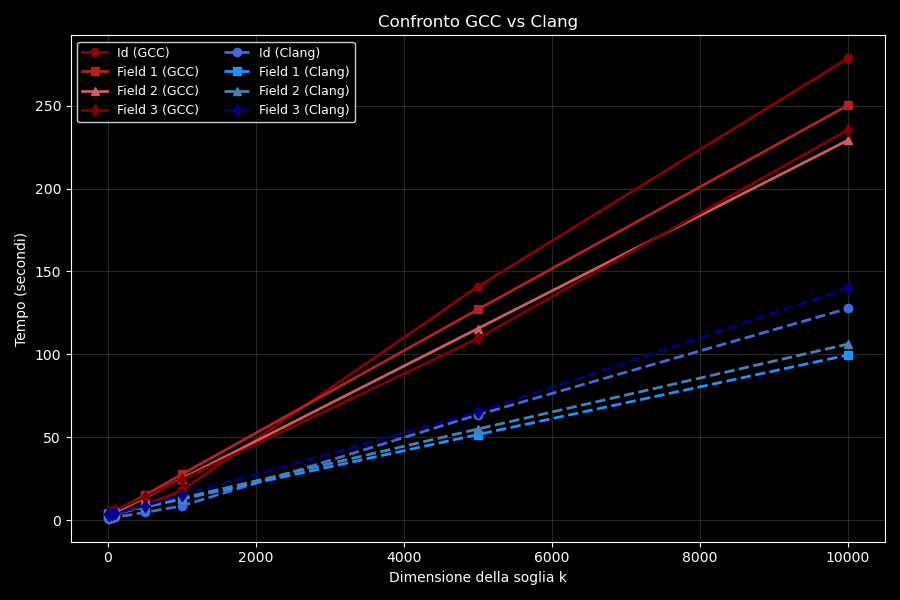
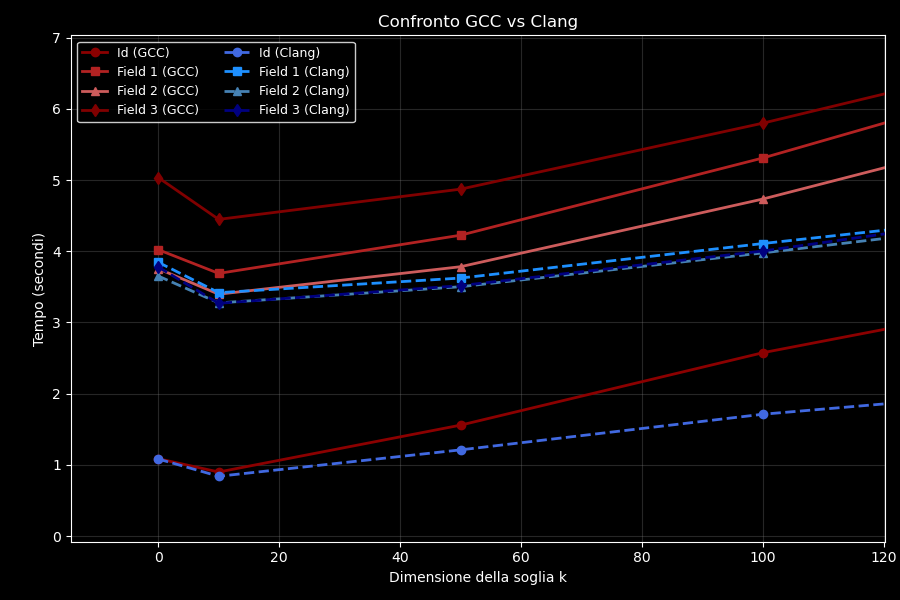

# Esercizio 1 - Hybrid Sort

### Descrizione dell'implementazione
L'algoritmo implementato è un **hybrid sort** che combina Quick Sort e Selection Sort:
* **Quick Sort**: usato per sub-array di dimensione ≥ k
    * Scelta del pivot: strategia median-of-three per ridurre il rischio di degenerazione a O(n²)
    * Partizionamento: schema di Hoare
* **Selection Sort**: usato per sub-array di dimensione < k, efficiente per piccoli array grazie al basso overhead

>#### Nota sulla strategia median-of-three
>La scelta del pivot tramite median-of-three è particolarmente efficace 
>su dati quasi ordinati o con pattern ripetitivi. Nel nostro caso:
>* `field3` contiene parole dalla Divina Commedia, quindi con alta ripetitività
>* I risultati mostrano prestazioni ragionevoli anche su questo campo, suggerendo che la strategia sia efficace

#### Parametro k
* `k = 0`: Quick Sort puro
* `k > n`: Selection Sort puro
* `0 < k ≤ n`: algoritmo ibrido

#### Dataset
* Numero di record: 20.000.000
* Dimensione record: 36 byte
* Campi ordinabili: 
    * Id: `uint64_t` 
    * Field1: `float`
    * Field2: `int64_t`
    * Field3: `char[16]`

---

### Tabella dei tempi di esecuzione (compilazione con GCC)
| Soglia k     | Id (s)     | Field1 (s) | Field2 (s) | Field3 (s) |
|-------------:|-----------:|-----------:|-----------:|-----------:|
| **0**        |   1.087411 |   4.022623 |   3.754910 |   5.035446 |
| **10**       |   0.900579 |   3.689283 |   3.397396 |   4.447834 |
| **50**       |   1.558701 |   4.225698 |   3.783098 |   4.872190 |
| **100**      |   2.575895 |   5.310072 |   4.733816 |   5.799128 |
| **500**      |   9.105234 |  15.078612 |  13.474356 |  13.974094 |
| **1000**     |  17.920121 |  27.673882 |  24.984537 |  24.412946 |
| **5000**     | 140.908252 | 127.109301 | 115.591207 | 109.668886 |
| **10000**    | 278.602170 | 250.273950 | 229.215311 | 235.425721 |
| **1000000**  |   TIMEOUT  |   TIMEOUT  |   TIMEOUT  |   TIMEOUT  |

**TIMEOUT**: Esecuzione interrotta dopo 5 minuti, comportamento incompatibile con l'uso pratico su 20 milioni di elementi.

### Tabella dei tempi di esecuzione (compilazione con Clang)
| Soglia k     | Id (s)     | Field1 (s) | Field2 (s) | Field3 (s) |
|-------------:|-----------:|-----------:|-----------:|-----------:|
| **0**        |   1.083272 |   3.845643 |   3.652631 |   3.779034 |
| **10**       |   0.840718 |   3.419031 |   3.275204 |   3.269309 |
| **50**       |   1.211507 |   3.623837 |   3.502085 |   3.517835 |
| **100**      |   1.711927 |   4.108892 |   3.977221 |   4.003827 |
| **500**      |   4.603841 |   7.819107 |   8.014928 |   8.778934 |
| **1000**     |   8.546301 |  12.701913 |  13.230480 |  14.924891 |
| **5000**     |  63.573103 |  51.610566 |  54.963437 |  65.134090 |
| **10000**    | 127.695747 |  99.587844 | 106.197655 | 139.881589 |
| **1000000**  |   TIMEOUT  |   TIMEOUT  |   TIMEOUT  |   TIMEOUT  |

**TIMEOUT**: Esecuzione interrotta dopo 5 minuti, comportamento incompatibile con l'uso pratico su 20 milioni di elementi.

---

### Confronto fra i compilatori GCC e Clang
Di seguito vengono riportati i grafici di confronto fra GCC e Clang.

<figure align="center">
    
    <figcaption>Confronto GCC vs Clang</figcaption>
</figure>

<figure align="center">
    
    <figcaption>Confronto GCC vs Clang su valori piccoli di k</figcaption>
</figure>

#### Analisi delle prestazioni per valori piccoli di k (k ≤ 50)

Per il campo **Id**, non si osservano differenze prestazionali significative tra GCC e Clang con valori molto piccoli di k.

Per gli altri campi, emergono invece differenze sostanziali:
* **Field1**: GCC è più lento dell'8% circa rispetto a Clang
* **Field2**: GCC è più lento del 4% circa rispetto a Clang  
* **Field3**: GCC è significativamente più lento, con una differenza fino al **36%** (k=10) e del **33%** anche per Quick Sort puro (k=0)

Clang mostra prestazioni più uniformi tra i diversi campi, mentre GCC evidenzia un progressivo peggioramento nell'ordine: Field2 < Field1 < Field3 (dal migliore al peggiore).

#### Analisi delle prestazioni per valori elevati di k

Considerando l'intero intervallo dei valori di k, e in particolare per k ≥ 500, Clang risulta sistematicamente più performante di GCC, con differenze che arrivano fino al **50-55%** per k=5000 e k=10000. Questo conferma una migliore scalabilità dell'esecuzione generata da Clang.

#### Spiegazione delle differenze

Le principali cause delle differenze prestazionali tra i due compilatori sono:

1. **Ottimizzazione dei loop**: Clang con `-O2` genera codice con migliore località spaziale nei cicli del Selection Sort, producendo sequenze di istruzioni più efficienti per l'accesso sequenziale alla memoria.

2. **Inlining dei comparatori**: Nell'utilizzo di comparatori implementati tramite puntatori a funzione, Clang è più aggressivo nell'inlining delle funzioni di confronto, mentre GCC tende a mantenere chiamate indirette che introducono overhead in termini di cicli di CPU.

3. **Ottimizzazione delle stringhe**: Per Field3 (stringhe da 16 byte), Clang ottimizza più efficacemente l'utilizzo di `memcmp()`, riducendo significativamente i tempi di confronto. Questo spiega la differenza marcata del 33-36% osservata su questo campo.

#### Valore ottimale di k

I grafici mostrano chiaramente come i tempi di esecuzione crescano in modo superlineare per k ≥ 50. Per tutti i campi analizzati si osserva un **minimo ben definito in corrispondenza di k=10**, che rappresenta il valore ottimale della soglia nel contesto sperimentale considerato.

---

### Analisi della complessità al variare di k

Per un array di n elementi con soglia k, il numero atteso di sotto-array che cadono sotto la soglia è approssimativamente n/k. Ciascuno costa O(k²) con Selection Sort, per un contributo totale di O(n × k).

Il costo complessivo diventa quindi:
- Parte Quick Sort: O(n log n)
- Parte Selection Sort: O(n × k)
- **Totale: O(n log n + n × k)**

**Implicazioni pratiche:**
* Quando k < log n, il termine n×k è trascurabile e si ottiene il miglioramento osservato
* Quando k cresce, il termine lineare in k inizia a dominare: già con k=500 si osserva un significativo degrado delle prestazioni
* Per k ≥ √n ≈ 4472, il comportamento diventa quasi quadratico, come confermato dai tempi per k=5000 e k=10000

---

### Analisi critica

#### Corrispondenza con le aspettative teoriche

I risultati sperimentali corrispondono alle previsioni teoriche:

* **Con k=0 (Quick Sort puro)**: i tempi sono compatibili con la complessità media O(n log n)
* **Con k=10 (Hybrid Sort)**: sempre più veloce del Quick Sort puro, con riduzioni di tempo tra l'8% e il 17% a seconda del campo
* **Con k ≥ 500**: i tempi crescono rapidamente a causa del contributo O(n × k) che diventa dominante
* **Con k=1000000 (Selection Sort puro)**: tutti i test terminano in timeout, come atteso per un algoritmo O(n²) su 20 milioni di elementi

La scelta del pivot tramite median-of-three ha evitato degenerazioni evidenti di Quick Sort verso il caso peggiore O(n²).

#### Valore ottimale di k

Per questo dataset, il valore che fornisce le prestazioni migliori su tutti i campi, come già evidenziato prima dal grafico, è **k=10**. Questo valore rappresenta un buon compromesso perché:

* Riduce l'overhead ricorsivo di Quick Sort, evitando chiamate su sub-array molto piccoli
* Sfrutta l'efficienza di Selection Sort su segmenti di dimensione ≤ 10, dove il costo quadratico è trascurabile (100 operazioni vs n log n)
* Valori più grandi (k ≥ 50) introducono troppo lavoro quadratico e fanno emergere la complessità O(n²)

Con n = 20.000.000 record, il numero di sub-array piccoli è elevato; k=10 minimizza l'overhead senza introdurre eccessiva componente quadratica.

#### Vantaggi dell'approccio ibrido

Rispetto ai singoli algoritmi puri, l'approccio ibrido offre:

* **Performance migliori**: per k=10 i tempi sono sempre inferiori a quelli del Quick Sort puro, con un guadagno dal 8% al 17%
* **Riduzione dell'overhead ricorsivo**: le chiamate ricorsive vengono evitate sui segmenti piccoli, gestiti direttamente da Selection Sort
* **Migliore utilizzo della cache**: Selection Sort su sub-array brevi (≤ 10 elementi ≈ 360 byte) sfrutta efficacemente la località di memoria

Questi vantaggi si osservano per valori moderati di k. Per k troppo alti, la quota di lavoro quadratico cresce e le prestazioni peggiorano rapidamente.

#### Differenze significative tra i tipi di campi

I tempi di ordinamento variano in modo significativo a seconda del campo (dati con k=10, GCC):

* **Id (uint64_t)**: 0.90 s - il più veloce. Il confronto tra interi non negativi è un'operazione nativa della CPU, molto efficiente
* **Field2 (int64_t)**: 3.40 s - circa 3.8× più lento di Id. La presenza di valori duplicati peggiora la prevedibilità dei branch nei confronti, introducendo overhead
* **Field1 (float)**: 3.69 s - circa 4.1× più lento di Id. L'overhead è dovuto alle operazioni in virgola mobile e alla gestione dei casi speciali (NaN, infiniti), che limitano alcune ottimizzazioni del compilatore
* **Field3 (char[16])**: 4.45 s - circa 4.9× più lento di Id. Ogni confronto richiede una chiamata a `memcmp()`, che confronta i dati byte per byte, aumentando il numero di accessi in memoria e riducendo l’efficienza complessiva, soprattutto in presenza di un numero elevato di confronti

Le differenze relative tra i campi rimangono sostanzialmente costanti al variare di k: l'algoritmo ibrido migliora tutti i campi in modo proporzionale.

#### Comportamento al crescere di k

Considerando il campo **Id** come esempio:

| k        | Tempo (s)  | Rapporto vs k=10 |
|---------:|-----------:|-----------------:|
| 10       |       0.90 |             1.0× |
| 50       |       1.56 |             1.7× |
| 100      |       2.58 |             2.9× |
| 500      |       9.11 |            10.1× |
| 5000     |     140.91 |           156.5× |
| 10000    |     278.60 |           309.3× |

La crescita è chiaramente superlineare per k ≥ 50, segno che la parte quadratica di Selection Sort domina sempre più la complessità complessiva.

#### Impatto della località di memoria

Selection Sort su array piccoli (k ≤ 10) dovrebbe beneficiare di:
- **Spatial locality**: i dati stanno in cache L1 (32-64 KB tipici)
- **Temporal locality**: elementi acceduti ripetutamente rimangono in cache

Per verificare questa ipotesi, sono state effettuate misurazioni con `perf stat`:

```bash
# Hybrid sort con k=10
$ perf stat -e cache-references,cache-misses ./main_ex1 records.bin out.bin 1 10

# Quick sort puro (k=0)
$ perf stat -e cache-references,cache-misses ./main_ex1 records.bin out.bin 1 0
```

**Risultati (campo Id):**

| Configurazione | Cache references | Cache misses | Miss rate |
|:---------------|:-----------------|:-------------|----------:|
| k=10 (hybrid)  | 272.726.941      | 104.112.284  |    38.17% |
| k=0 (pure QS)  | 272.926.144      | 104.303.671  |    38.22% |

La differenza di **0.05 punti percentuali** nel miss rate non è statisticamente significativa. Questo risultato suggerisce che:
* Il beneficio principale dell'approccio ibrido non deriva dalla cache
* L'overhead ricorsivo ridotto è probabilmente il fattore dominante

---

### Gestione della memoria

Il programma gestisce la memoria nel modo seguente:

1. **Allocazione principale**: un unico array di `Record` viene allocato dinamicamente in `main.c` tramite `malloc(sizeof(Record) * num_recs)`, con dimensione esatta pari al numero di record nel file di input

2. **Ordinamento in-place**: l'algoritmo `hybridsort()` ordina direttamente questo array senza creare copie aggiuntive o strutture ausiliarie che crescano con n

3. **Allocazioni temporanee**: in `hybridsort.c`, le funzioni `swap()` e `hoare_partition()` allocano piccoli buffer temporanei di `size` byte per gestire scambi e pivot. Questi buffer vengono sempre liberati immediatamente con `free()` prima dell'uscita dalle funzioni

4. **Deallocazione**: alla fine dell'ordinamento, i record ordinati vengono scritti sul file di output e l'array principale viene rilasciato con `free(records)`

#### Rilevamento memory leak

Per prevenire e individuare eventuali memory leak, il programma è stato compilato in modalità debug con il flag `-fsanitize=address`. Questa opzione abilita AddressSanitizer, che consente di rilevare:
* Accessi a memoria non valida (buffer overflow, use-after-free)
* Perdite di memoria (memory leak)
* Stack/heap buffer overflow

In caso di errore, AddressSanitizer fornisce un dettagliato stack trace utile per l'analisi e la correzione del problema.

---

### Conclusioni e raccomandazioni

* L'ibrido Quick Sort + Selection Sort con pivot median-of-three si comporta in modo stabile e coerente con le aspettative teoriche

* **Per il dataset di 20 milioni di record, k=10 è il valore ottimale** che bilancia efficacemente il costo ricorsivo e il costo quadratico

* **Clang offre prestazioni superiori a GCC**, specialmente per valori elevati di k e per l'ordinamento di stringhe (Field3), con differenze fino al 50% in alcuni scenari

* Per dataset significativamente diversi (in dimensione o distribuzione dei dati), è consigliabile ripetere l'analisi variando k nell'intervallo 5-20 per verificare se il valore ottimale cambia

* **Valori di k elevati (k ≥ 500) vanno evitati** perché portano rapidamente a tempi non accettabili. Nel caso estremo (k=1.000.000), il timeout di 5 minuti viene superato su tutti i campi